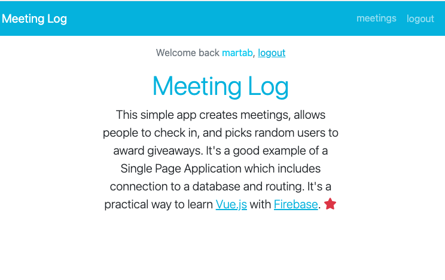

<!-- PROJECT TITLE -->
 

<h2 align="center">Vue Fullstack applications with Firebase</h3>

 Linkedin course by Ray Villalobos

 

 

## About the project

I've followed this LinkedIn <a href="https://www.linkedin.com/learning/vue-js-full-stack-applications-with-firebase?contextUrn=urn%3Ali%3AlyndaLearningPath%3A5d94ce0a498e93731fbb8711">course</a> offered by Ray Villalobos.

Quickly assemble useful applications by combining the Vue.js front-end framework with the easily accessible power of the Firebase server engine from Google. This course shows how to create a working single-page app using the Vue.js framework layered on the Firebase cloud platform.
It includes features like user registration and authentication.

I am on my way to achieve a :rocket: fullstack overview!

 

 

## Built with

Major frameworks/libraries used:

- Vue
- Babel
- Bootstrap
- Vue-Router
- Firebase
- Popper

 

## Author

I'm Marta Boteller, little more about me at my [website](https://martaboteller.com).

   

## Acknowledgments

This course was prepared with older versions of Vue and Vuetify. Minor changes have been implemented now.
  I would like to thank <a href="https://www.linkedin.com/learning/vue-js-full-stack-applications-with-firebase?contextUrn=urn%3Ali%3AlyndaLearningPath%3A5d94ce0a498e93731fbb8711">Ray Villalobos </a>for his fantastic way of teaching!

##
